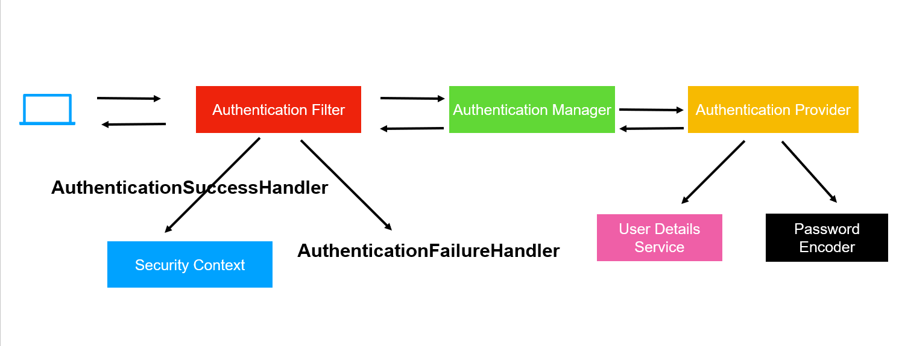

# Security Configuration

This Project makes use of Spring Security along with JWT token for authorization and authentication. The following is the breakdown of the config files and security files. All the headings point to the respective filename in the project

## CorsConfig
Cross-Origign Resource Sharing (CORS) is an HTTP-header based mechanism that allows an application or server indicate any origin which could be in the form of domain or port other than it's own address from which a browser should permit loading resources.

This implies that we can specify the exact address from where our server will accept requests (usually our frontend) any other server/application trying to contact our server will be rejected.

In the class CorsConfig we implement WebMvcConfigurer and customize the the CorsMappings Registry. WebMvcConfigurer can be used to implement custom viewResolvers, exception Handling and other aspects of traditional Spring MVC. Here we are only focusing on the CORS filters. 

Add the origin domain in the form of -> 

```allowedOrigins("domain URL").allowCredentials(true) ```

Include the allowed request headers ->

```allowedHeaders("*")``` to allow all headers, can be customized


Include the allowed methods ->

```allowedMethods("GET","POST","PUT","DELETE","PATCH")``` to allow these specified http methods

---

## SpringSecurity Implementation

The SpringSecurity class has the annotations @Configuration which entails that there are multiple @Bean methods that may be processed by the spring container at runtime. The @EnableWebSecurity annotation is used for Spring Security Web support and integration with Spring MVC. We require this since we are providing custom authentication logic with AuthManagers, JWT etc.



### UserDetailsService
This is injected to obtain the specific user data such as username and password at the time of authentication

### JwtRequestFilter 
This is a bean injected which is a custom filter for handling JWT token (explained later).

### PasswordEncoder
Bean is used initialize the password Encoder to be used while storing and comparing passwords, here we are using BCrypt encoder.

### SecurityFilterChain
This method is used to filter the requests received by the application, here we set which all endpoints can be accessed by which types of users. We can also specify the request method accepted by an endpoint. Any endpoint that does not follow the specified requestMatchers() is rejected with an error code of 4xx unauthorized.
We have also disabled csrf() for the version 1 for simplicity, will be enabled in later versions to prevent cross site resource forgery attacks.

The last filter which is RequestMatcher("/api/admin/**).authenticated() ensures only authenticated users can access the admin endpoints.

The addFilterBefore() method is used to add a particular custom filter (in our case is JwtRequestFilter) before a known filter which will be applied by spring security which in this case is the UsernamePasswordAuthenticationFilter.
We are simply asking spring to perform JWT Filter and validate the JWT token before the final username password auth occurs which returns response as success or failed to user.

### Configure
This method is used to configure the AuthenticationManager to use the userDetailsService and the specified passwordEncoder. We have overriden the methods of these 2 and hence need to direct Spring to use these and not the default.

### AuthenticationManager
Define the custom auth manager to use the auth managerbuilder from HttpSecurity to build the authManager at runtime.

---

## CustomCustomerDetailsService

This is a custom implementation of the UserDetailsService which is used to retreive user data at the time of auth. This is marked with @Service annotation as it is a service provider during authentication.

We initialize a customerRepository instance to interact with the database.

### loadUserByUsername
We override this method to retreive the user by username from the database using the customerRepository. The username here is the email, the repo finds the user by email and returns a customer. If the customer is null throw exception.

If the customer is found, we create a new user bean and pass the email and password which is used for authentication, along with this we pass the role to differentiate between normal user and admin.